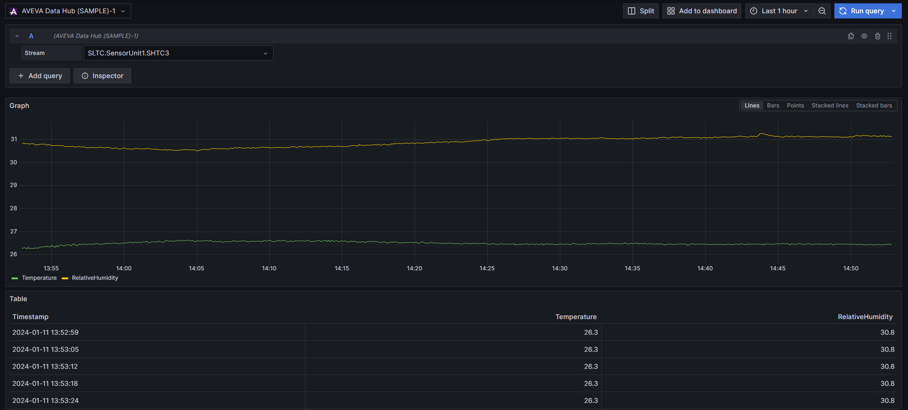
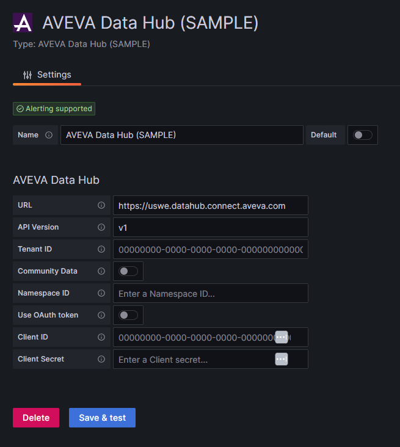

# CONNECT data services (Cds) data source backend plugin sample

**Version:** 1.1.0

[](https://dev.azure.com/osieng/engineering/_build/latest?definitionId=4858&repoName=osisoft%2Fsample-adh-grafana_backend_plugin-datasource&branchName=main)

This sample demonstrates how to build a [Grafana](https://grafana.com/) data source backend plugin that runs queries against the Sequential Data Store (SDS) of CONNECT data services or Edge Data Store. The sample performs normal "Get Values" calls against a specified stream in SDS, using the time range of the Grafana dashboard. For more information about backend plugins, refer to the documentation on [Backend plugins](https://grafana.com/docs/grafana/latest/developers/plugins/backend/).


## Prerequisites
- Web Browser with JavaScript enabled
- [NodeJS](https://nodejs.org/en/)
- [Go](https://go.dev/)
- [Mage](https://magefile.org/)
- [Git](https://git-scm.com/download/win)
- [Grafana 11.5.3+](https://grafana.com/grafana/download) (if running in Grafana server)
- Docker Desktop (if running with Docker) [Windows](https://docs.docker.com/desktop/setup/install/windows-install/) [Mac](https://docs.docker.com/desktop/setup/install/mac-install/) [Linux](https://docs.docker.com/desktop/setup/install/linux/)
- If using CONNECT data services and not using OAuth passthrough, register a Client Credentials Client in CONNECT data services; a client secret will need to be provided to the sample plugin configuration
- If using Edge Data Store, the browser must be running local to a running copy of Edge Data Store

## Running the sample in Grafana Server

1. Copy this folder to your Grafana server's plugins directory, like `.../grafana/data/plugins`
1. (Optional) If using other plugins, rename the folder to `aveva-data-hub-sample`
1. Open a command prompt inside that folder
1. Install dependencies, using `npm ci`
1. Build the plugin, using `npm run build` (or `npm run dev` for browser debugging)
1. Update Grafana plugin SDK for Go dependency to the latest minor version, using `go get -u github.com/grafana/grafana-plugin-sdk-go` and `go mod tidy`
1. Build backend plugin binaries for Linux, Windows, and Darwin, using `mage -v`
1. Restart the Grafana server to load the new plugin
1. Open the Grafana configuration and set the parameter `allow_loading_unsigned_plugins` equal to `aveva-sds-datasource` or to the name of the folder set in step 2 (see [Grafana docs](https://grafana.com/docs/grafana/latest/administration/configuration/#allow_loading_unsigned_plugins))
1. Add a new Grafana datasource using the sample (see [Grafana docs](https://grafana.com/docs/grafana/latest/features/datasources/add-a-data-source/))
1. Choose whether to query against AVEVA Data Hub or Edge Data Store
1. Enter the relevant required information; if using ADH, the client secret will be encrypted in the Grafana server and HTTP requests to ADH will be made by a server-side proxy, as described in the [Grafana docs](https://grafana.com/docs/grafana/latest/developers/plugins/authentication/)
1. Open a new or existing Grafana dashboard, and choose the Sequential Data Store Sample as the data source
1. Enter your Namespace (if querying ADH) and Stream, and data will populate into the dashboard from the stream for the dashboard's time range

## Running the sample with Docker

1. Open a command prompt inside this folder
1. Build the container using `docker build -t grafana-adh .`  
   _Note: The dockerfile being built contains an ENV statement that creates an [environment variable](https://grafana.com/docs/grafana/latest/administration/configuration/#configure-with-environment-variables) that overrides an option in the grafana config. In this case, the `allow_loading_unsigned_plugins` option is being overridden to allow the [unsigned plugin](https://grafana.com/docs/grafana/latest/administration/configuration/#allow_loading_unsigned_plugins) in this sample to be used._
1. Run the container using `docker run -d --name=grafana -p 3000:3000 grafana-adh`
1. Navigate to localhost:3000 to configure data sources and view data

## Using ADH OAuth login to Grafana

To use AVEVA Data Hub as an Identity provider through OAuth, add the following generic OAuth configuration to your grafana server's custom.ini. Please note, you may need to create a new custom.ini if one does not already exist and an Authorization Code Client with the appropriate redirect URLs will need to be generated. For more information please refer to Grafana's [configuration documentation](https://grafana.com/docs/grafana/latest/setup-grafana/configure-grafana/) or their [Generic OAuth documentation](https://grafana.com/docs/grafana/latest/auth/generic-oauth/).

```ini
[auth.generic_oauth]
enabled = true
name = AVEVA Data Hub
allow_sign_up = true
client_id = <PLACEHOLDER_CLIENT_ID>
scopes = openid profile email ocsapi offline_access
auth_url = https://uswe.datahub.connect.aveva.com/identity/connect/authorize
token_url = https://uswe.datahub.connect.aveva.com/identity/connect/token
api_url = https://uswe.datahub.connect.aveva.com/identity/connect/userinfo
role_attribute_path = contains(role_type[*], '2dc742ab-39ea-4fc0-a39e-2bcb71c26a5f') && 'Admin' || contains(role_type[*], 'f1439595-e5a2-487f-8a4f-0627fefe75df') && 'Editor' || 'Viewer'
use_pkce = true
```

| Setting             | Description                                                                                                                                                                                                                                                                                                                                                    |
| ------------------- | -------------------------------------------------------------------------------------------------------------------------------------------------------------------------------------------------------------------------------------------------------------------------------------------------------------------------------------------------------------- |
| enabled             | Whether generic OAuth is enabled.                                                                                                                                                                                                                                                                                                                              |
| name                | The name of the Identity Provider. This is also what is shown on the button when prompted for login.                                                                                                                                                                                                                                                           |
| allow_sign_up       | This setting allows Grafana users to be automatically created upon login. With this set to false, an administrator would have to create an account within Grafana for a user before said user could access Grafana.                                                                                                                                            |
| client_id           | The Authorization Code Client Id. By default, refresh tokens are not issued and the token lifetime is 1 hour. To enable refresh tokens and allow the token to be refreshed for up to 8 hours, AllowOfflineAccess must be set to true on the client's configuration, which can be set within the API console.                                                   |
| scopes              | The OAuth scopes to be designate what access the application should have to the user’s account. OpenId, Profile, and Email are used to gather information about the user and determine what their role should be if role_attribute_path is specified. Ocsapi gives the user access to the CONNECT data services API. Offline_access is used to enable refresh tokens. |
| auth_url            | The well-known authorization URL of CONNECT data services (may depend on region).                                                                                                                                                                                                                                                                                     |
| token_url           | The well-known token URL of CONNECT data services (may depend on region).                                                                                                                                                                                                                                                                                             |
| api_url             | The well-known user information URL of CONNECT data services (may depend on region).                                                                                                                                                                                                                                                                                  |
| role_attribute_path | Defines how roles are mapped between AVEVA Data Hub and Grafana.                                                                                                                                                                                                                                                                                               |
| use_pkce            | Enables and forces Grafana to use PKCE.                                                                                                                                                                                                                                                                                                                        |

## Use the sample plugin to configure a data source
- In Grafana, navigate to Connections > Data Sources
- Find and click the CONNECTDataServices data source and enter the required information for either CONNECT data services or Edge Data Store



## Using Community Data

1. Add a new Grafana datasource using the sample (see [Grafana docs](https://grafana.com/docs/grafana/latest/features/datasources/add-a-data-source/))
1. Choose CONNECT data services
1. Toggle the "Community Data" switch to 'true'
1. Enter the relevant required information. You can find the Community ID in the URL of the Community Details page.

## Running the Automated Tests on Frontend Components

1. Open a command prompt inside this folder
1. Install dependencies, using `npm ci`
1. Run the tests, using `npm test`

## Running the Automated Tests on Backend Components

1. Open a command prompt inside the `pkg/cds` folder
1. Install dependencies, using `go mod tidy`
1. Run the tests, using `go test`

---
  
For the main AVEVA samples page [ReadMe](https://github.com/AVEVA)
